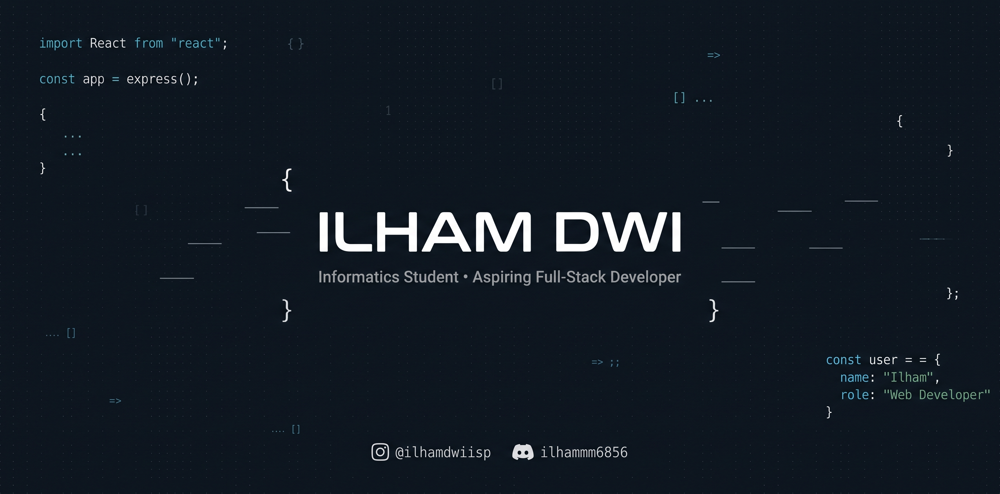

  

<h1 align="center">Hi there, I'm Ilham Dwipangga 👋</h1>

  Building practical web and mobile solutions with clean architecture, high curiosity, and a focus on solving everyday problems.

---

## ✨ About Me

I’m an Informatics Engineering student at **Politeknik Negeri Semarang (Polines)** who enjoys developing practical applications, from mobile productivity tools to full-stack web platforms and interactive games.

- 🎓 **Education:** Informatics Engineering at Politeknik Negeri Semarang (Polines)
- 💡 **Focus Areas:** Full-Stack Web Development, Mobile App Development, and Game Logic
- 🌱 **Currently Exploring:** Modern JavaScript ecosystem, Advanced Flutter/Dart architecture, and Backend APIs

---

<!-- ## 🛠️ What I build -->

<!-- 

<table>
  <tr>
    <td align="center" width="33%">
       
      <strong>Web Apps</strong> 
      React · Next.js · Tailwind
    </td>
    <td align="center" width="33%">
       
      <strong>Mobile Apps</strong> 
      Flutter · Dart
    </td>
    <td align="center" width="33%">
       
      <strong>Game Development</strong> 
      Unity · C#
    </td>
  </tr>
  <tr>
    <td align="center" width="33%">
       
      <strong>Backend Systems</strong> 
      Laravel · PHP · Node.js · Python
    </td>
    <td align="center" width="33%">
       
      <strong>Databases & BaaS</strong> 
      Supabase · PostgreSQL · MySQL
    </td>
    <td align="center" width="33%">
       
      <strong>Design & Workflow</strong> 
      Git · Figma · Notion · VS Code
    </td>
  </tr>
</table> -->

<!-- --- -->

## 🧠 Tech Stack & Tools

### Frontend & Mobile

### Backend & Databases

### Tools & Platforms

---

## 🚀 Featured Projects

<table>
  <tr>
    <th><strong>Project</strong></th>
    <th><strong>Category</strong></th>
    <th><strong>Stack</strong></th>
    <th><strong>Description</strong></th>
  </tr>
  <tr>
    <td><a href="https://github.com/IlhamDwi22/mystudymate"><strong>mystudymate</strong></a></td>
    <td>Mobile SaaS</td>
    <td><code>Flutter</code> <code>Dart</code></td>
    <td>Aplikasi produktivitas untuk membantu mahasiswa mengelola aktivitas akademik dan kolaborasi tugas dalam satu ekosistem digital.</td>
  </tr>
  <tr>
    <td><a href="https://github.com/IlhamDwi22/EntopFvnky"><strong>EntopFvnky</strong></a></td>
    <td>2D Game</td>
    <td><code>Unity</code> <code>C#</code></td>
    <td>Game petualangan 2D rhythm yang menggabungkan mekanisme platformer dengan pertarungan berbasis ketukan ritme musik.</td>
  </tr>
</table>

---

## 📊 GitHub Activity

<!-- 

 -->

  

  

---

<h2 data-importer="text" align="left">Play Games With Me!</h2>

###

###

###

---

## 🔗 Connect With Me

  
  
  
  

